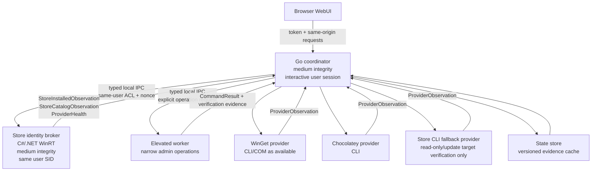

# ADR 0001: Microsoft Store Update Detection Architecture

Date: 2026-06-21

Status: Proposed

Scope: Architecture audit and migration plan only. This ADR intentionally does not change production behavior.

## Context

The current Store update pipeline is built around command-line inventory from AppX, Store CLI, and WinGet, then merges those observations into a single `Package` shape. That design has produced user-visible false positives, false negatives, and unsafe update targets because several identifiers are treated as equivalent when they are not.

The non-negotiable identity rules for the next architecture are:

- Store installed identity is primarily `(user SID, package family name)`.
- Package full name is a versioned installation instance.
- Store Product ID is a catalog/action identifier.
- Display names, localized names, fuzzy matches, normalized names, and search rank are never identity.
- "Current" is emitted only after a fresh, complete scan in the correct user context with required providers healthy.
- Provider failure, parser rejection, stale evidence, unresolved identity, incomplete coverage, or user-context mismatch produces `unknown`, not `current`.

Official Microsoft documentation confirms the important identity and user-scope properties:

- `PackageManager.FindPackagesForUser(String)` finds packages installed for the specified user, and the empty-string user argument means current user: https://learn.microsoft.com/en-us/uwp/api/windows.management.deployment.packagemanager.findpackagesforuser?view=winrt-28000
- `PackageManager.FindPackages(...)` enumerates packages across users and has different privilege/capability requirements: https://learn.microsoft.com/en-us/uwp/api/windows.management.deployment.packagemanager.findpackages?view=winrt-28000
- `PackageId` exposes `FamilyName`, `FullName`, `Name`, `PublisherId`, and `Version`: https://learn.microsoft.com/en-us/uwp/api/windows.applicationmodel.packageid?view=winrt-28000
- Microsoft's package identity overview describes package full name as the unique full identity of a specific package or bundle, while package family name is a stable family identity: https://learn.microsoft.com/en-us/windows/apps/desktop/modernize/package-identity-overview
- `PackageCatalog.OpenForCurrentUser()` opens the catalog of packages available to the current user: https://learn.microsoft.com/en-us/uwp/api/windows.applicationmodel.packagecatalog.openforcurrentuser
- `PackageCatalog` events are current-user scoped when opened through `OpenForCurrentUser`: https://learn.microsoft.com/en-us/uwp/api/windows.applicationmodel.packagecatalog
- The WinGet COM API is a package-management API, but it is gated by capability/elevation constraints and is not a Store identity API by itself: https://github.com/microsoft/winget-cli/blob/master/doc/specs/%23888%20-%20Com%20Api.md

## Current Pipeline Trace

### Server and process context

- `internal/updater/main.go::Main` relaunches the application elevated by default unless `--no-elevate` is provided.
- `internal/updater/main.go::runServer` starts the WebUI, then immediately calls `app.refreshStatus(true)` and `app.refreshInventory(true)`.
- Because the coordinator is normally elevated, all Store/AppX/WinGet/Chocolatey detection runs from the elevated process token unless a user starts with `--no-elevate`.

### Installed package discovery

- `internal/updater/package_inventory.go::getInventory` is the coordinator for package inventory.
- `internal/updater/package_inventory_collect.go::collectInventoryInputs` runs these collectors in parallel:
  - `appxInstalled()`
  - `storeInstalled()` and `storeUpdates()` when Store CLI is available
  - `wingetInstalled()` and `wingetUpdates()` when WinGet is available
  - `chocoInstalled()` and `chocoUpdates()` when Chocolatey is available
- `internal/updater/package_appx.go::appxInstalled` first tries:
  - `Get-AppxPackage -AllUsers -PackageTypeFilter Main,Framework,Bundle,Optional`
  - then falls back to current-user `Get-AppxPackage`
- `internal/updater/package_appx.go::parseAppxPackageJSON` maps AppX rows into `Package` with:
  - `ID = PackageFullName`
  - `Match = PackageFamilyName`
  - `Manager = store`
  - `Source = appx`
  - `ActionBackend = appx-inventory`
  - `UpdateSupported = false`

Audit result: AppX inventory can be all-users scoped, but the resulting package model does not record the user SID. It also uses `PackageFullName` as the package ID even though that value is versioned.

### Store CLI inventory and updates

- `internal/updater/package_store.go::storeInstalled` runs `store installed`.
- `internal/updater/package_store.go::storeUpdates` runs `store updates --apply false`.
- `internal/updater/package_store.go::parseStorePackageTable`, `parseStoreInstalled`, and `parseStoreUpdatePackages` parse human-readable text tables.
- `internal/updater/package_store.go::storePackageFromColumns` uses `id = name` when no ID column is present.
- `internal/updater/package_store.go::parseStoreUpdatePackages` marks parsed rows as `UpdateAvailable = true`.

Audit result: Store CLI output is not treated as structured evidence. When Store CLI output lacks a stable Product ID, the current parser promotes the display name to `ID`, which violates the Store identity model.

Local probe result on 2026-06-21:

- `store --help` reported Store CLI `v22605.1401.12.0 - Preview`.
- `store update --help` reported required argument `<update-id>` as "The update id of the product to check for updates."
- `store updates --help` exposed human-oriented options including `--apply`, but no machine-readable output mode was observed.

### WinGet and msstore update parsing

- `internal/updater/package_winget_inventory.go::wingetInstalled` runs both `winget list --accept-source-agreements --disable-interactivity` and `winget export --include-versions`.
- `internal/updater/package_winget_inventory.go::wingetUpdates` runs:
  - `winget upgrade --accept-source-agreements --disable-interactivity`
  - `winget upgrade --source msstore --accept-source-agreements --disable-interactivity`
- `internal/updater/package_winget.go::parseWingetTable` parses human-readable WinGet tables and maps `Source = msstore` to `Manager = store` through `wingetSourceManager`.
- `internal/updater/package_winget_inventory.go::mergeWingetUpdateOutput` stores update observations by `packageKey(manager, strings.ToLower(pkg.ID))`.

Audit result: WinGet `msstore` can provide useful package update signals, but it is not currently connected to a Store identity evidence model. It is merged by text IDs and source labels.

### Store/AppX merge logic

- `internal/updater/package_appx_merge.go::mergeStoreAppxPackages` merges Store and AppX rows by normalizing `ID`, `Name`, and `Match`.
- `internal/updater/package_appx_merge.go::mergeStoreNativeUpdatePackages` merges native Store update rows into packages using `storePackageIdentityCandidates`.
- `internal/updater/package_appx_merge.go::storePackageIdentityCandidates` includes `pkg.ID`, `pkg.Name`, `pkg.Match`, and `stableStoreActionID(...)`.
- `internal/updater/package_appx_merge.go::storeUpdateForPackage` matches update observations by `pkg.Name`, `pkg.ID`, `stableStoreActionID(pkg.ID)`, `pkg.Match`, and `stableStoreActionID(pkg.Match)`.
- `internal/updater/package_appx_merge.go::applyStoreUpdateVersion` allows a same-version Store update to be treated as an update when Store CLI is available.

Audit result: The merge layer treats display name, package full name, package family name, and derived strings as interchangeable. This is the main architecture defect.

### Identity normalization

- `internal/updater/package_manager.go::normalizePackageIdentity` lowercases input, removes `_8wekyb3d8bbwe`, and removes all non-alphanumeric characters.
- It is used for Store/AppX merging, Store resolver decisions, scan matching, search ranking, auto-update key equivalence, and update retry matching.
- `internal/updater/store_identity.go::stableStoreActionID` strips an AppX full name down to a prefix before `_` when it sees a dotted prefix.

Audit result: `normalizePackageIdentity` is acceptable for search ranking display order, but not for Store identity. It currently participates in identity-equivalence decisions, violating the first invariant.

### Display-name Store resolver and cache

- `internal/updater/package_store_resolver.go::resolveStoreAppxPackages` tries to resolve AppX inventory-only rows by running `storeSearch(query)` with `query = item.pkg.Name`.
- `internal/updater/package_store_resolver.go::chooseStoreResolution` scores Store search results by normalized name/ID candidates and result rank.
- `internal/updater/package_store_resolver.go::storeResolutionScore` accepts exact normalized matches or first-result substring matches.
- `internal/updater/state.go::StoreResolveCacheEntry` stores:
  - `AppXVersion`
  - `StoreID`
  - `StoreName`
  - `StoreVersion`
  - `Resolved`
  - `ResolvedAt`
- Cache key is `strings.ToLower(packages[i].ID)`, where AppX `ID` is currently `PackageFullName`.

Audit result: This cache does not include user SID, package family name as the primary key, provider generation, provider health, source, or confidence evidence. It can preserve unsafe display-name search mappings for up to six hours.

### API serialization

- `internal/updater/package_manager.go::Package` exposes `UpdateAvailable bool` and `AvailableVersion string`.
- `internal/updater/app.go::InventoryResponse` returns the merged `Inventory` plus async loading metadata.
- `internal/updater/http_handlers.go::serveAPI` returns inventory through `GET /api/packages`.

Audit result: There is no tri-state update model. Absence of an update is indistinguishable from parser failure, stale evidence, unresolved identity, incomplete coverage, or user-context mismatch.

### UI rendering

- `internal/updater/assets/ui.js` filters update rows with `!!pkg.update_available`.
- The installed package table renders packages as `Current` when `UpdateSupported != false` and `update_available` is false.
- `internal/updater/assets/ui.js::packageAvailableCell` special-cases same-version Store updates as "Pending in Microsoft Store."

Audit result: The UI can display `Current` from a false boolean even when the correct state is `unknown`.

### Update execution

- `internal/updater/package_store_actions.go::runStoreUpdatePackageWithFallbackContext` uses native Store CLI first and then WinGet msstore fallback.
- `internal/updater/package_store_actions.go::runNativeStoreUpdate` tries target candidates and then `runStoreSearchUpdateFallback`.
- `internal/updater/package_action_targets.go::storeUpdateTargetCandidates` includes:
  - `pkg.ID`
  - `stableStoreActionID(pkg.ID)`
  - `pkg.Match`
  - `stableStoreActionID(pkg.Match)`
  - `pkg.Name`
- `internal/updater/package_store_actions.go::runStoreSearchUpdateFallback` searches Store by `pkg.Name` and updates the selected search result.

Audit result: Store update execution can silently fall back to a display-name search and can try the display name as an update target. This violates the exact-target invariant.

### Post-update refresh and verification

- `internal/updater/operation_job_actions.go::startUpdatePackagesOperation` refreshes inventory after update commands finish.
- `internal/updater/update_retry.go::updatePackageWithInventoryRetry` treats command success as sufficient unless target fallback/retry logic is triggered.
- `internal/updater/update_retry.go::findPackageForUpdateRetry` can match retry targets by normalized `Name`, `Match`, and `stableStoreActionID`.

Audit result: A command success currently means the request was accepted. It does not prove final update success. Post-update verification depends on the same unsafe inventory and identity merge logic.

## Decision

Choose process architecture A:

- The main WebUI/coordinator runs medium-integrity in the interactive user's session.
- Store inventory and Store update detection run in that same user context.
- A narrowly scoped elevated worker is started only for operations that require administrative rights, such as machine-scope Chocolatey operations, machine-scope WinGet operations, or scheduled task changes.

Choose C#/.NET WinRT broker as the primary native integration technology for Store identity and current-user AppX inventory. The broker is responsible for current-user Store/AppX identity and evidence collection. Store CLI and WinGet msstore remain fallback or corroborating providers, not canonical identity providers.

## 1. Proposed Process And Data-Flow Architecture



Core data-flow rule: providers emit evidence, not final truth. The coordinator computes final update state only from observations that share the same user identity and scan generation.

## 2. Chosen Process-Integrity And User-Session Model

The coordinator must run medium-integrity in the interactive user's session by default. That is the only model that makes `PackageManager.FindPackagesForUser("")`, `PackageCatalog.OpenForCurrentUser()`, Store CLI, and Microsoft Store UX behavior naturally refer to the user who is viewing the WebUI.

Administrative work moves to an elevated worker:

- Coordinator launches the worker only for explicit admin-required operations.
- Worker receives typed operation requests, never a general shell command from the browser.
- Worker returns command result plus post-operation evidence.
- Worker does not own Store identity resolution.

This directly fixes the current `internal/updater/main.go::Main` elevation model, where the whole app is elevated and AppX queries can be all-users scoped.

Implemented privilege-boundary scaffolding:

- `internal/updater/main.go::Main` starts the WebUI/coordinator without default self-elevation.
- `internal/updater/main.go::Main` supports `--elevated-worker` mode for the worker process.
- `internal/updater/elevated_worker_protocol.go` defines protocol versioning, request IDs, per-launch capability authorization, user SID/session checks, strict payload decoding, and operation allowlisting.
- `internal/updater/elevated_worker_windows.go` implements the same-executable elevated worker over a per-launch Windows named pipe.
- `internal/updater/windows_privilege.go::shellExecuteRunasProcess` launches the worker through UAC with `ShellExecuteExW`.
- `internal/updater/package_actions.go::installPackageContext` and `updatePackageWithMetadataContext` delegate WinGet and Chocolatey mutations to the worker when the coordinator is not elevated.
- Store package install/update paths are not delegated, so legacy Store work still runs in the current-user coordinator process.
- `internal/updater/windows_tasks.go::createStartupTaskDirect` creates startup tasks at limited run level so WebUI startup does not elevate the coordinator.
- `internal/updater/windows_tasks.go::createAutoUpdateTask` delegates the high-run-level auto-update task to the worker when elevation is required.
- `docs/windows-smoke-tests/privilege-boundary.md` defines required manual Windows smoke coverage for administrator users, standard users with separate admin credentials, multiple sessions, UAC cancellation, worker crash, and browser reload.

## 3. Chosen Native Integration Technology

Primary choice: C#/.NET WinRT broker.

Reasons:

- Strong Windows Runtime projection support for `Windows.Management.Deployment.PackageManager` and `Windows.ApplicationModel.PackageCatalog`.
- Lower implementation risk than in-process Go COM/WinRT.
- Easier structured JSON IPC and error handling than C++/WinRT.
- Can be compiled as a small Windows-only broker executable and shipped next to the Go coordinator.

The local PowerShell WinRT spike under `tools/spikes/store-identity-probe` validated that the current environment can call:

- `PackageManager.FindPackagesForUser("")`
- `PackageManager.FindPackagesForUser("", packageFamilyName)`
- `PackageCatalog.OpenForCurrentUser()`

Local result summary: PackageManager available, current-user `FindPackagesForUser` available, 147 current-user packages observed, `PackageCatalog.OpenForCurrentUser` available. The probe output was not committed because it contains user-specific package and path data.

The .NET spike under `tools/spikes/store-broker-dotnet` was not compiled locally because `dotnet` is not installed in the current PATH.

## 4. Deployment And Single-Distribution Strategy

Recommended distribution:

- `WindowsUpdaterWebUI.exe`: Go coordinator and WebUI.
- `WindowsUpdater.StoreBroker.exe`: C#/.NET WinRT medium-integrity broker.
- `WindowsUpdater.ElevatedWorker.exe`: small elevated worker for admin-only operations.

Portable build options:

- Prefer a ZIP containing the three signed binaries and static assets embedded in the Go binary.
- If single-file UX is required, embed broker and worker binaries as resources and extract them to a versioned application data directory after verifying their hash.

Signing implications:

- Sign all shipped executables with the same publisher certificate.
- The elevated worker should have a stable signed identity because it crosses the UAC boundary.
- The medium-integrity Store broker does not require elevation or package identity for `FindPackagesForUser("")`, but signing improves SmartScreen and IPC trust decisions.

## 5. Typed IPC Protocol And Security Model

Use a local named pipe with:

- DACL restricted to the current user SID and Administrators.
- Per-session random nonce generated by the coordinator.
- Request/response JSON with explicit schema version.
- No browser-originated shell command strings.

Minimum message types:

```json
{
  "schema": 1,
  "nonce": "redacted",
  "request_id": "uuid",
  "operation": "store.inventory.current_user",
  "scan_generation": "uuid",
  "caller_user_sid_hash": "sha256-redacted"
}
```

Store broker response shape:

```json
{
  "schema": 1,
  "request_id": "uuid",
  "provider": "winrt-appx-current-user",
  "provider_health": "healthy",
  "user_sid_hash": "sha256-redacted",
  "scan_generation": "uuid",
  "observed_at_utc": "2026-06-21T00:00:00Z",
  "packages": [
    {
      "package_family_name": "Microsoft.WindowsStore_8wekyb3d8bbwe",
      "package_full_name": "Microsoft.WindowsStore_22605.1401.12.0_x64__8wekyb3d8bbwe",
      "name": "Microsoft.WindowsStore",
      "publisher_id": "8wekyb3d8bbwe",
      "installed_version": "22605.1401.12.0"
    }
  ],
  "diagnostics": []
}
```

Security rule: the coordinator can display friendly names, but update identity and update execution must use verified identifiers from broker/provider evidence.

## 6. Canonical Identity Model

Introduce typed identity values instead of overloading `Package.ID`:

```go
type StoreInstalledIdentity struct {
    UserSIDHash         string
    PackageFamilyName  string
}

type StoreInstalledInstance struct {
    Identity        StoreInstalledIdentity
    PackageFullName string
    InstalledVersion string
}

type StoreCatalogIdentity struct {
    ProductID string
    Source    string
}

type StoreCatalogMapping struct {
    Installed StoreInstalledIdentity
    Catalog   StoreCatalogIdentity
    Evidence  MappingEvidence
}
```

Rules:

- `PackageFamilyName` is the installed Store identity key with the current user SID.
- `PackageFullName` is an installed instance and must never be used as a durable package key across versions.
- Product ID is an action/catalog identifier and must not be guessed from display name.
- Display names are UI metadata only.
- Search results are discovery metadata only until verified by exact provider identity evidence.

The existing `internal/updater/package_manager.go::normalizePackageIdentity` may remain for search ranking, but it must be removed from Store identity equivalence.

## 7. Provider Model

Provider output must include health, freshness, user scope, scan generation, and evidence quality.

Provider categories:

- `winrt-appx-current-user`: authoritative installed Store/MSIX identity for current user.
- `winrt-package-catalog`: current-user package catalog and package change events.
- `store-cli`: consumer Store CLI; fallback diagnostics and update invocation only when exact update ID is verified.
- `winget-msstore`: secondary update signal; not canonical installed Store identity.
- `winget`: existing WinGet non-Store behavior.
- `chocolatey`: existing Chocolatey behavior.

Each provider returns:

- `provider_id`
- `provider_version`
- `provider_health`: `healthy`, `unavailable`, `failed`, `partial`, `stale`, `unsupported`
- `user_scope`: `current-user`, `all-users`, `machine`, or `unknown`
- `scan_generation`
- `observed_at_utc`
- observations
- raw diagnostics reference

Provider failure must be represented in API and UI, not collapsed into no update.

## 8. Update-State Model

Replace the Store-facing boolean model with a failure-aware state model:

- `available`: update positively observed for exact identity.
- `current`: fresh complete scan, correct user, all required providers healthy, authoritative negative result.
- `unknown`: unresolved identity, stale evidence, provider failure, parser rejection, incomplete coverage, or user-context mismatch.
- `conflict`: healthy providers disagree for the same identity and scan generation.
- `inapplicable`: newer catalog version exists, but no applicable installer exists for this machine/user.
- `pending`: update accepted by Store but not yet verified installed.

For all managers, API can keep `update_available` during migration, but Store rows must add `update_state` and `update_state_reason`. UI must prefer `update_state` when present.

Current false behavior to remove:

- `internal/updater/assets/ui.js` rendering `Current` when `pkg.update_available` is false.
- `internal/updater/package_appx_merge.go::applyStoreUpdateVersion` treating same-version Store observations as updateable without structured pending evidence.
- `internal/updater/package_store_resolver.go::applyStoreResolution` turning unresolved or stale searches into boolean update state.

Implemented inactive model path:

- `internal/updater/store_update_model.go::StoreInstalledIdentity` represents installed Store identity as user SID plus package family name.
- `internal/updater/store_update_model.go::StoreScanGeneration` carries scan ID, user SID, start/completion timestamps, Windows version/build, architecture, provider versions, provider health, and completion status.
- `internal/updater/store_update_model.go::StoreProviderIdentity`, `StoreProviderHealth`, and `StoreProviderObservation` represent provider identity and evidence.
- `internal/updater/store_update_model.go::VerifiedStoreIdentityMapping` separates installed package identity from Store Product ID mapping.
- `internal/updater/store_update_model.go::ExactStoreUpdateTarget` represents an update target verified for a specific installed identity.
- `internal/updater/store_update_model.go::StoreUpdateAssessment` is the final reconciled state.
- `internal/updater/store_update_model.go::ReconcileStoreUpdate` is pure and deterministic. It invokes no commands, reads no global state, and performs no network access.
- `internal/updater/store_update_model.go::StoreAssessmentToLegacyPackage` is the temporary compatibility adapter. It sets legacy `Package.UpdateAvailable` only when the new assessment is `available`; for `unknown`, `conflict`, `inapplicable`, and `pending`, it prevents legacy rendering from treating missing evidence as `current`.
- `internal/updater/store_update_model.go::storeUpdateAssessmentModelEnabled` is currently `false`, so this model does not change active Store detection results.

Implemented API/UI projection path:

- `internal/updater/package_manager.go::Package` exposes additive Store assessment fields including `update_state`, `update_reason`, `observed_at`, `stale`, `scan_id`, exact identity/action-target flags, provider summaries, installed package family name, verified Store Product ID, installed/offered versions, and applicability.
- `internal/updater/store_update_api.go::applyStoreUpdateAssessmentProjection` is the feature-flagged compatibility projection used by `GET /api/packages`.
- `internal/updater/store_update_api.go::storeUpdateAssessmentEnabled` is controlled by `UPDATER_STORE_UPDATE_ASSESSMENT=1` while `storeUpdateAssessmentModelEnabled` remains false.
- `internal/updater/store_update_api.go::applyStoreAssessmentCompatibility` preserves the legacy `update_available` field but derives it only from `update_state == "available"`.
- `internal/updater/update_job_packages.go::packageAllowedInBulkUpdate` and `internal/updater/operation_job_actions.go::startSingleUpdateJob` prevent Store update jobs from starting unless the Store row has an exact verified action target.
- `internal/updater/assets/ui.js::renderStoreScanHealth` renders persistent Store provider health and diagnostic details. It intentionally distinguishes `unknown` from `current`.

User-facing rule: `unknown` means the app does not have fresh, complete, user-correct, identity-safe Store evidence. It is not equivalent to "up to date." The UI must not show "all apps are up to date" while Store coverage is unknown, stale, incomplete, unresolved, conflicting, or failed.

Implemented transactional scan pipeline path:

- `internal/updater/store_scan_store.go::StoreScanStore` is a pure-Go SQLite persistence layer using `modernc.org/sqlite`, so the portable build does not require CGO.
- `internal/updater/store_scan_store.go::applyStoreScanMigration1` creates the durable tables `scan_runs`, `installed_package_families`, `installed_package_instances`, `verified_identity_mappings`, `provider_runs`, `provider_observations`, `update_assessments`, and `schema_migrations`.
- `internal/updater/store_scan_store.go::migrateJSONStoreAssessmentCache` imports only exact, previously verified positive Store assessment cache entries from the legacy JSON state. It does not alter unrelated JSON settings.
- `internal/updater/store_scan_pipeline.go::StoreScanPipeline` performs the atomic scan workflow: capture immutable scan context, enumerate current-user packages, run catalog providers with independent deadlines, persist provider health/evidence, reconcile per `(user SID, package family name, scan generation)`, persist assessments, and publish the completed generation atomically.
- `internal/updater/store_scan_pipeline.go::StoreCatalogProvider` is the exact catalog provider interface. Production currently uses `unsupportedStoreCatalogProvider`, which records unsupported provider health rather than fabricating `current`.
- `internal/updater/store_scan_inventory_adapter.go::applyStoreTransactionalScanPipeline` is gated by `UPDATER_STORE_TRANSACTIONAL_SCAN=1` and applies only published PFN-keyed assessments to package responses.
- Positive-result hysteresis is implemented in `internal/updater/store_scan_pipeline.go::reconcileStoreScanAssessments`: failed or incomplete scans cannot erase a previous positive update; retained positives are marked stale.
- Publication is generation-safe: `internal/updater/store_scan_store.go::publishScanTx` refuses to publish an older scan over a newer published generation.

Implemented current-user packaged-app inventory path:

- `internal/updater/store_packaged_inventory.go::StorePackagedAppInventoryProvider` is the provider interface used by the coordinator, so tests can use deterministic fakes.
- `internal/updater/store_packaged_inventory.go::brokerStorePackagedAppInventoryProvider` invokes the ADR-selected native broker executable and parses a strict JSON protocol.
- `native/store-inventory-broker/Program.cs` is the C#/.NET WinRT broker source. It uses `PackageManager.FindPackagesForUser(string.Empty)` for current-user enumeration and does not call PowerShell or `Get-AppxPackage -AllUsers`.
- `internal/updater/store_packaged_inventory.go::StorePackagedAppRecord` retains user SID, package family name, package full name, identity name, publisher, publisher ID, four-part version, processor architecture, install location, package type, package classification, development/staged state, package status, and display name metadata.
- `internal/updater/store_packaged_inventory.go::groupStorePackagedAppFamilies` groups records by exact `(user SID, package family name)` and does not use `normalizePackageIdentity`.
- `internal/updater/store_packaged_inventory.go::packagesFromNativeStorePackagedInventory` adapts only product-like families to the temporary legacy `Package` shape when the feature flag is enabled.
- `internal/updater/store_packaged_inventory_compare.go::compareStorePackagedInventory` powers diagnostic dual-run comparison without merging records or changing update decisions.

Feature flags:

- `UPDATER_NATIVE_STORE_INVENTORY=1` enables native current-user packaged-app inventory as the AppX inventory source.
- `UPDATER_NATIVE_STORE_INVENTORY_DUAL_RUN=1` runs native inventory and legacy AppX inventory side by side and emits diagnostics only.
- `UPDATER_STORE_INVENTORY_BROKER=<path>` overrides the broker executable path.
- `UPDATER_STORE_UPDATE_ASSESSMENT=1` enables API/UI display of the new Store update-state projection.
- `UPDATER_STORE_TRANSACTIONAL_SCAN=1` enables the SQLite-backed Store scan pipeline and published-assessment adapter.

Unverified in this workspace:

- The C# broker was not compiled or executed because `dotnet` is not installed in the active PATH.
- Real `Package.DisplayName` behavior is OS-version-dependent; Microsoft documents that it can return empty for non-current packages on older Windows versions.
- The broker currently records package status flags exposed by `Package.Status`; catalog update detection remains out of scope.

## 9. Persistence Strategy

Create a new state section, versioned separately from the current `State.StoreResolveCache`:

```json
{
  "store_identity_cache_schema": 1,
  "store_observations": {
    "scan_generation": "uuid",
    "user_sid_hash": "sha256-redacted",
    "observed_at_utc": "2026-06-21T00:00:00Z",
    "provider_health": {}
  },
  "store_catalog_mappings": {}
}
```

Persistence rules:

- Cache keys include user SID hash and package family name.
- Every observation includes scan generation.
- Old generations cannot erase newer positive update observations.
- Provider failure cannot erase an available update observation unless a newer authoritative provider result proves current for the same identity.
- Legacy `StoreResolveCache` is unsafe for Store identity and must be ignored once the new feature flag is enabled.

Current implementation note: the transactional scan database is stored as `store-scans.sqlite` under the existing state directory. Corrupt databases are renamed with a `.corrupt.<timestamp>` suffix and a new database is initialized. This recovery policy preserves the broken file for diagnostics and avoids blocking app startup.

## 10. Migration Plan From Current Implementation

Do not migrate legacy display-name resolver entries into the new identity cache.

Migration steps:

1. Add new identity/evidence structs and Store update-state fields behind a feature flag.
2. Add broker IPC and current-user AppX provider in read-only mode.
3. Record both legacy Store package results and new broker evidence in diagnostics.
4. Compare legacy and broker output in logs without changing UI behavior.
5. Switch Store UI to use `update_state` under feature flag.
6. Disable `package_store_resolver.go` display-name resolution under the new feature flag.
7. Remove display-name Store update fallback after exact Store target support is implemented.
8. Remove or quarantine `StoreResolveCache` after one release cycle.

No existing WinGet or Chocolatey migration is required for this phase.

## 11. Feature Flags And Rollback Plan

Feature flags:

- `store.identity_broker.enabled`
- `store.identity_broker.read_only`
- `store.legacy_display_name_resolver.enabled`
- `store.update_state_model.enabled`
- `store.exact_target_execution.enabled`

Rollback:

- Disable `store.identity_broker.enabled` to return to current legacy providers.
- When falling back, UI must show Store coverage as `unknown` if legacy providers are incomplete or unsafe.
- Do not re-enable display-name update execution by default.
- Keep raw diagnostics export for both broker and legacy providers.

Rollback must not claim `current` for Store rows if the broker is disabled and legacy evidence is incomplete.

## 12. Test Strategy And Windows VM Matrix

Automated tests:

- Unit tests for identity types: `(user SID hash, package family name)` equality only.
- Unit tests proving display name, normalized punctuation, fuzzy string, and search rank never establish Store identity.
- Provider failure tests: failed Store CLI, failed broker, parser rejection, stale generation, wrong user, and partial coverage all produce `unknown`.
- Merge tests proving observations from different users and scan generations do not merge.
- Cache tests proving stale negative observations do not erase newer positive observations.
- IPC tests with fake broker and fake elevated worker.
- UI tests proving `unknown`, `blocked`, `pending`, `available`, and `current` render distinctly.
- Update execution tests proving Store update requires exact verified target.
- Post-update verification tests proving command acceptance is not final success.

Windows VM matrix:

- Windows 10 22H2, standard user and elevated flows.
- Windows 11 23H2.
- Windows 11 24H2.
- Current Insider/preview Store CLI build when available.
- Localized OS, at least German and English.
- Store CLI missing, Store CLI present, Store CLI preview.
- WinGet missing, old WinGet, current WinGet.
- Multiple local users with different Store app inventory.
- Offline/network failure.
- Microsoft Store signed in and signed out.

Build/test requirements:

- `go test ./...`
- Windows build with `go build -ldflags="-H=windowsgui"`
- Broker build and broker unit tests on Windows SDK/.NET machine.
- End-to-end VM tests for medium-integrity coordinator and elevated worker.

## 13. Known Unknowns Requiring Real-Machine Validation

The following are not yet proven by this audit:

- Whether public WinRT APIs expose authoritative available Store update versions for arbitrary installed Store apps.
- Whether exact Product ID can be mapped from package family name through supported public APIs without display-name search.
- Whether Microsoft Store catalog APIs expose installer applicability and structured update errors for consumer apps.
- Whether Store CLI has an undocumented or future machine-readable mode.
- Whether Store CLI `update-id` is stable Product ID, an update-specific ID, or another catalog identifier across all apps.
- Whether WinGet COM exposes enough msstore identity metadata to map Product ID to package family name.
- How Store and WinGet COM APIs behave when the coordinator is medium-integrity but a worker is elevated.
- Minimum Windows SDK/runtime components required for the C# broker in portable distribution.
- Whether `PackageCatalog` change events are sufficient for durable post-update verification without polling.

Local validations completed:

- `tools/spikes/store-identity-probe/Probe-StoreIdentity.ps1` successfully called current-user `FindPackagesForUser` and `PackageCatalog.OpenForCurrentUser`.
- `store --help`, `store update --help`, and `store updates --help` were available locally and confirmed the command-line interface is human-oriented.

## 14. Small Implementation PR Sequence

1. Add Store identity and provider evidence types without changing runtime behavior.
2. Add feature flags and expose them in diagnostics.
3. Add fake Store broker interface and deterministic tests.
4. Add C#/.NET Store broker read-only executable and IPC tests.
5. Run broker in read-only shadow mode from the medium-integrity coordinator.
6. Add update-state model to API while keeping existing boolean fields for compatibility.
7. Change UI to render Store `unknown` distinctly and stop showing `Current` from absent evidence.
8. Replace AppX `-AllUsers` production inventory with current-user broker inventory for Store rows.
9. Disable display-name Store resolver when broker identity is enabled.
10. Add exact Store catalog/action target mapping when validated.
11. Change Store update execution to require exact verified target.
12. Add post-update verification against installed state and fresh provider evidence.
13. Remove legacy `StoreResolveCache` reads after a migration window.
14. Remove unsafe Store identity uses of `normalizePackageIdentity`.

## Architecture Alternatives

### A. Medium-integrity coordinator plus narrow elevated worker

Decision: chosen.

User-context behavior:

- Store/AppX queries run as the same interactive user who opened the WebUI.
- `FindPackagesForUser("")` and `PackageCatalog.OpenForCurrentUser()` naturally align with the visible Microsoft Store session.

Security model:

- Least privilege by default.
- Admin rights are requested only for operations that require them.
- Browser cannot directly invoke elevated shell commands.

Implementation complexity:

- Requires worker IPC and process lifecycle management.
- Requires migrating startup behavior away from unconditional elevation.

Deployment implications:

- Multiple binaries or embedded extracted helper binaries.
- More moving parts, but each process has a clear responsibility.

Signing implications:

- Sign coordinator, broker, and elevated worker.
- Stable signatures improve SmartScreen and UAC trust.

Failure modes:

- Broker unavailable: Store state becomes `unknown`; WinGet/Chocolatey remain available.
- Worker unavailable: admin operations are disabled or require retry; Store detection remains available.

### B. Elevated coordinator plus medium-integrity Store broker

User-context behavior:

- Store broker can query current-user Store/AppX state if launched into the correct interactive user session.
- Coordinator remains elevated, so it must be careful not to mix elevated observations with broker observations.

Security model:

- Better than current monolith for Store correctness, but elevated coordinator still owns WebUI operations.
- Larger attack surface at high integrity.

Implementation complexity:

- Requires session brokering anyway.
- Requires strict boundaries to prevent elevated coordinator from doing Store identity work.

Deployment implications:

- Similar helper-binary requirements as A.
- Startup still incurs UAC unless special-cased.

Signing implications:

- Same as A.

Failure modes:

- Broker launch in wrong session causes `unknown`.
- Elevated coordinator may still accidentally run all-user AppX or Store CLI queries if legacy paths remain.

Conclusion: acceptable fallback architecture, but inferior to A because it preserves unnecessary elevation.

### C. Current elevated monolith with in-process Windows APIs

User-context behavior:

- Elevated process context can diverge from Store current-user context.
- Current code already uses all-users AppX inventory when possible.

Security model:

- Largest attack surface because WebUI coordinator and package operations run elevated.

Implementation complexity:

- Lowest short-term process complexity.
- Highest correctness risk because all identity rules must be enforced inside a process already prone to wrong-user queries.

Deployment implications:

- Single binary remains simplest.

Signing implications:

- Single signed binary.

Failure modes:

- Wrong-user Store state.
- All-users observations merged into one UI.
- Provider failure silently rendered as current unless the data model is overhauled.

Conclusion: rejected. It optimizes packaging simplicity over Store correctness.

## Native Integration Options

### C#/.NET WinRT broker

Decision: chosen.

Pros:

- Good WinRT projection support.
- Fast development and strong typed JSON/IPC support.
- Easy to isolate behind a process boundary.
- Easier tests with deterministic broker fakes.

Cons:

- Requires .NET SDK at build time.
- Portable deployment must include a self-contained broker or document runtime dependency.

### C++/WinRT broker

Pros:

- Native Windows dependency model.
- No .NET runtime dependency.
- Strong WinRT support and small runtime footprint.

Cons:

- Higher implementation and build complexity.
- Toolchain not available in this workspace.
- More complex JSON/IPC/error handling.

Conclusion: viable if .NET distribution size or runtime policy becomes unacceptable.

### In-process Go COM/WinRT integration

Pros:

- Single language and potentially single process.

Cons:

- High correctness and maintenance risk.
- Go has no first-class WinRT projection comparable to C# or C++/WinRT.
- In-process integration works against the desired process isolation.

Conclusion: rejected for Store identity.

### Store CLI and WinGet CLI only

Pros:

- Already implemented.
- No new native code.

Cons:

- Human-readable output.
- Unclear stable Product-ID mapping.
- Current implementation has already shown identity and parsing failures.

Conclusion: keep only as fallback/diagnostic providers.

## Required Production Corrections Identified By Audit

These are not implemented in this ADR:

- Stop using AppX `-AllUsers` for current user's Store inventory.
- Stop using `PackageFullName` as a durable Store package key.
- Stop using `normalizePackageIdentity` for Store identity equivalence.
- Stop resolving AppX inventory-only rows through display-name `store search`.
- Stop executing Store updates with display-name fallback targets.
- Replace boolean `Package.UpdateAvailable` with a failure-aware update-state model.
- Treat provider failures and parser rejection as `unknown`.
- Add exact post-update verification.

## Implemented API And WebUI Integration Path

The HTTP package response now carries Store assessment fields on each Store
`Package` plus a response-level `store_scan_health` summary. The compatibility
boolean `update_available` is derived from `update_state == "available"` when
assessment data is present.

The WebUI renders Store states as `Available`, `Current`, `Unknown`,
`Conflict`, `Inapplicable`, `Pending`, and stale variants. It shows provider
diagnostics, scan ID, timestamps, and sanitized provider errors in details
panels. Store update controls are disabled unless
`exact_action_target_available` is true.

The transactional scan source is now the default. Refresh jobs run the
transactional scan and `/api/packages` reads the latest published generation
from SQLite. The legacy detector is re-enabled only by the explicit emergency
rollback flag `UPDATER_STORE_LEGACY_DETECTOR=1`.

Unknown remains intentionally distinct from Current. Missing evidence, failed
providers, unresolved identity, incomplete coverage, stale evidence, and
unverified action targets must surface as non-authoritative Store status rather
than silently clearing updates.

## Implemented Exact Store Update Execution Path

Store packages that carry assessment data now use an exact execution path. The
request is accepted only when the selected package has a fresh `available`
assessment, an exact package family name, and a verified Product ID or exact
provider target. Stale assessments, missing targets, unresolved identities, and
non-available Store states are rejected before a command is started.

The command runner treats Store CLI success as `accepted`, then runs
post-action verification. Verification checks exact current-user inventory for
package full-name or version changes and supports a provider interface for
fresh targeted catalog queries. Until the native catalog provider exists, a
Store command can end as `accepted_not_verified`; it is not reported as
success.

The active exact path never retries by display name and never runs a Store
search after exact-target failure. The legacy `runStoreSearchUpdateFallback`
helper remains isolated for now, but it is no longer called by the active
Store update path.

Native API validation notes:

- Microsoft documents `PackageCatalog.OpenForCurrentUser` package events as
  current-user scoped. The implementation exposes an event-source interface but
  production currently uses a no-op source until the native broker implements
  it.
- Microsoft documents `PackageManager.FindPackagesForUser` for user-scoped
  package enumeration. Production verification uses the existing current-user
  packaged inventory provider abstraction and deterministic tests cover the
  verification rules.

## Implemented Store Detector Cutover

The transactional Store detector is now the default production path. The
emergency rollback flag `UPDATER_STORE_LEGACY_DETECTOR=1` is intentionally
time-bounded to one release cycle and is the only path that re-enables legacy
Store truth production.

Normal Store detection no longer:

- Runs display-name Store resolution from `package_store_resolver.go`.
- Merges Store/AppX rows by `normalizePackageIdentity`.
- Uses Store CLI `store updates` table rows as authoritative update truth.
- Imports WinGet `msstore` rows into installed Store update truth.
- Uses `Get-AppxPackage -AllUsers` as the normal Store inventory provider.
- Executes Store updates through display-name search fallback.
- Treats empty human-readable provider output as an authoritative negative.

The legacy Store parsers remain only as explicit adapters for Store search,
Store install, tests, and the rollback path. Failure of the new detector
produces `Unknown` through `StoreScanHealthSummary`; it does not silently invoke
the old fuzzy detector.

Store auto-update preferences are migrated to canonical current-user package
family identity. Persisted keys use `(user SID, package family name)`, while
normal WebUI package selection continues to use package family names and does
not expose raw user SIDs. Only exact PFN keys and exact Product IDs from
verified assessment cache entries migrate automatically. Ambiguous legacy
preferences are disabled and recorded in the state migration report.

Store diagnostics export is available at `/api/store/diagnostics/export` and
through the WebUI scan-health panel. The export contains scan context, provider
versions and health, package family identities, sanitized observations, final
assessments, and migration notes. It hashes user scope and excludes raw user
SIDs, credentials, tokens, account identifiers, and install paths.
